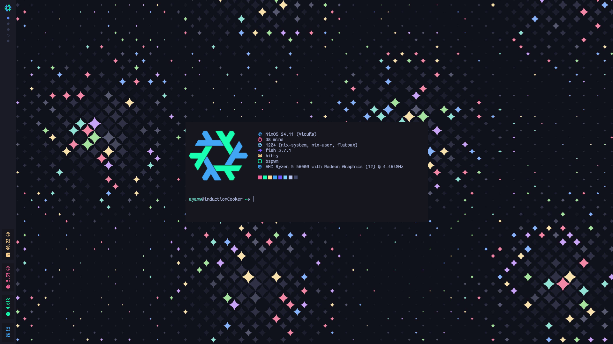

# 󱄅 ​ AyanW's NixOS + Home-Manager Configurations 󱄅 

## Build Instructions
 - Clone this repo
 - Replace `./required/hardware-configuration.nix` with your own hardware config. This step is crucial. Skipping this will probably prevent the newly generated boot entry to not boot.
 - Probably create a backup for your current `.config` (everything is riced to oblivion)
 - (WSL) Disable GUI apps [[modules/apps/default.nix](modules/apps/default.nix)]
 - (WSL) Disable systemd services [[modules/services/default.nix](modules/services/default.nix)]
 - Run `sudo nixos-rebuild [switch|boot|whatever]`

## Explanation
 - `./settings.nix`: self-explanatory, read the file
 - `./required/configuration.nix`: replacement for `/etc/nixos/configuration.nix`
 - `./required/hardware-configuration.nix`: replacement for `/etc/nixos/hardware-configuration.nix`
 - `./required/home.nix`: home-manager configuration
 - `./config/`: files that will be in `.config/`
 - `./modules/`: basically `/etc/nixos/configuration.nix` modularized

[TO-DO]